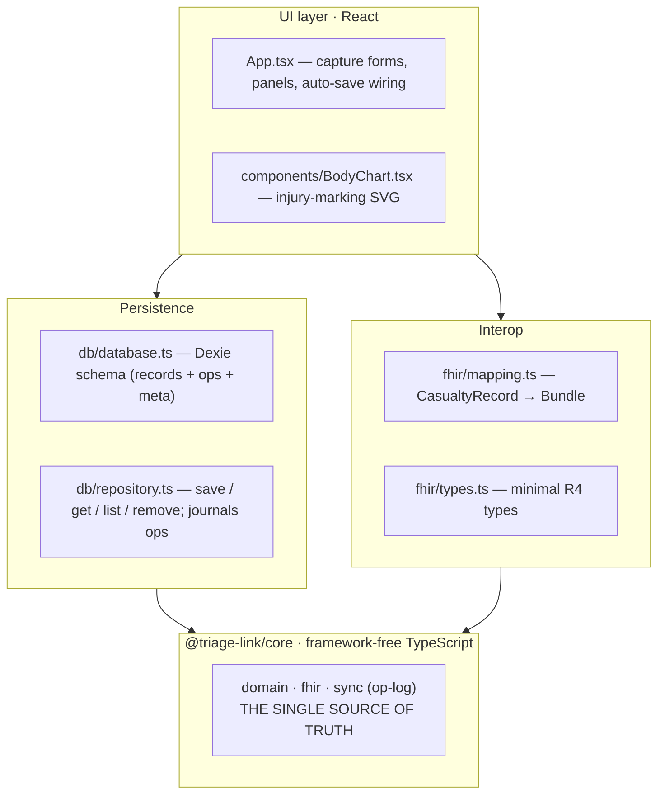
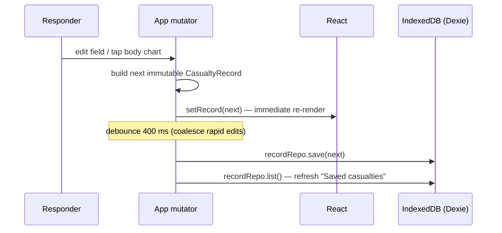
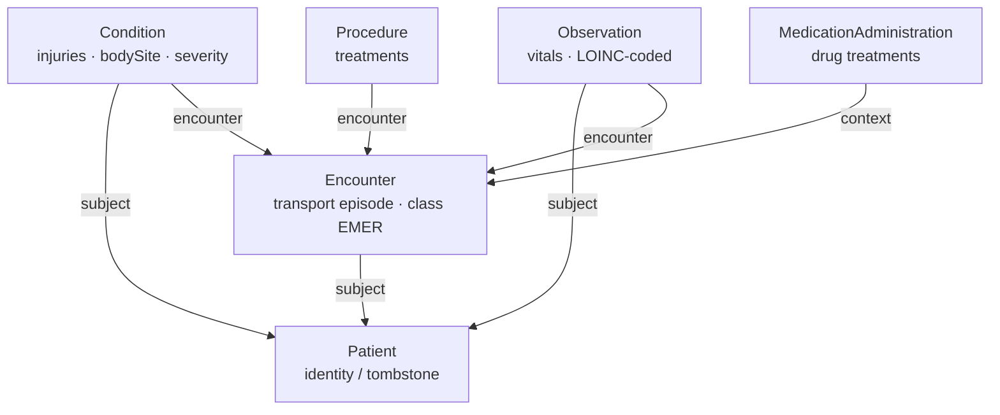
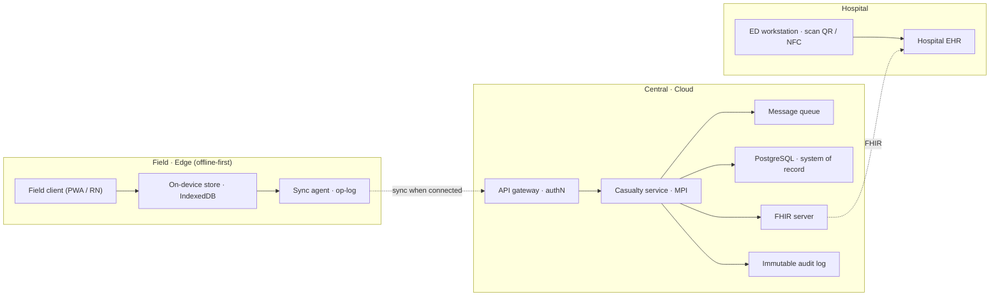
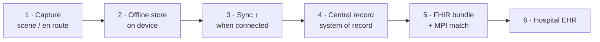
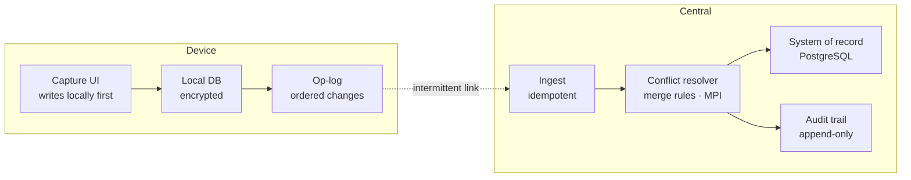
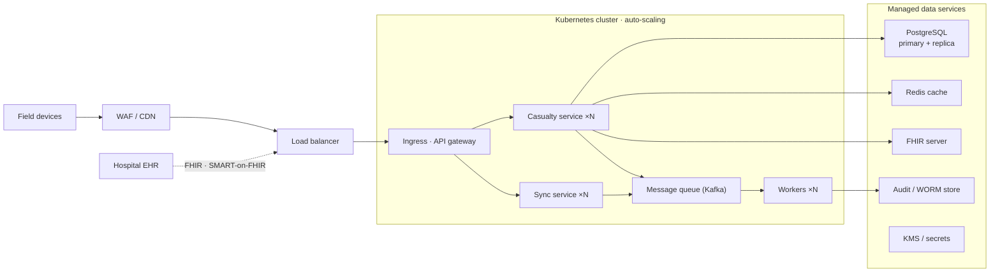
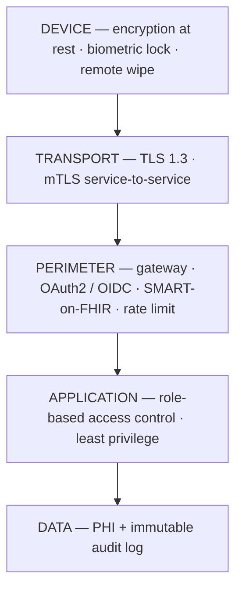

# TRIAGE-LINK — Technical Architecture

> Offline-first Progressive Web App for casualty care & transport documentation.
> Field responders capture a patient's identity, injuries on a 2-D body chart,
> vitals, and treatments — then hand the record to a receiving hospital as a
> standards-compliant **HL7 FHIR R4** bundle.

> ⚠️ **Prototype — not a medical device and not for clinical use.** Part II and the
> _Security_ / _Regulatory_ sections describe what a real deployment would require;
> none of it is implemented in the current codebase.

This document has two parts:

- **Part I — As Built** describes the system exactly as it exists in this repo today:
  a client-only, offline-first PWA.
- **Part II — Target Architecture** describes the production system this prototype is
  designed to grow into: a three-zone topology with central services, conflict-aware
  sync, and hospital EHR integration.

---

# Part I — As Built (current prototype)

## 1. Purpose & context

TRIAGE-LINK is a digital replacement for the paper triage tag used by emergency
responders at accident scenes and mass-casualty incidents. A single responder, often
with no network connectivity, captures a patient's identity, injuries, vital signs,
and treatments at the point of care, then hands that record to a receiving hospital
as an HL7 FHIR R4 bundle.

### Primary actors

| Actor | Role |
|---|---|
| **Field responder** (paramedic, medic, first-aider) | Captures the casualty record on a phone/tablet, usually offline |
| **Receiving facility** (hospital EHR) | Imports the exported FHIR bundle at handover |

### Driving requirements

1. **Works with no connectivity.** The scene may have no signal; the app must be fully functional offline and lose no data.
2. **Runs anywhere, installs like an app.** Responders carry heterogeneous devices; a single codebase must run on all of them.
3. **Interoperates with hospital systems.** Handover output must be in a format hospital EHRs already understand.
4. **Fast, low-friction capture.** Tap-to-mark injuries; auto-save; no modal "save" step.

## 2. Architectural goals & principles

| Principle | How it shows up in the code |
|---|---|
| **Offline-first** | All state lives on-device in IndexedDB; no backend is required for the core workflow |
| **Portability first** | Delivered as a PWA — one static bundle runs on any modern browser and installs to the home screen |
| **Framework-free core** | `src/domain` and `src/fhir` are plain TypeScript with zero React/Dexie imports, reusable by a future React Native client or backend sync service unchanged |
| **Single source of truth** | The `CasualtyRecord` type in `src/domain/types.ts` is the canonical model every other layer maps to/from |
| **Standards over bespoke formats** | Interop is via HL7 FHIR R4 with LOINC-coded vitals, not a proprietary schema |
| **Local-only by default** | No PHI leaves the device unless the user explicitly exports a bundle |

## 3. Technology choices

| Concern | Choice | Rationale |
|---|---|---|
| Client framework | **React 18 + TypeScript** | Component model for the capture UI; static typing across the domain |
| Build / dev server | **Vite 5** | Fast dev server, simple static production build |
| Offline storage | **IndexedDB** via **Dexie 4** | Durable, async, on-device store with a typed table API; no backend needed |
| Offline shell | **vite-plugin-pwa** (Workbox) | Service worker precaches the app so it loads with no network |
| Interop | **HL7 FHIR R4** | The de-facto hospital EHR exchange standard |

There are intentionally **no runtime dependencies** beyond React and Dexie — the domain
and mapping logic are hand-written TypeScript.

## 4. System structure

The app is organised in layers, from a framework-free core outward to the UI.
Dependencies point **inward only**: the UI depends on the domain, never the
reverse. The domain model, FHIR mapping, and op-log engine live in their own
**npm workspace package, `@triage-link/core`**, so they can be reused by other
clients (e.g. a React Native app or the sync service) without the React/Dexie
shell.

> **Note on paths.** Modules referenced below as `domain/…`, `fhir/…`, and
> `sync/…` live in the core package under `packages/core/src/`; the React app
> lives at the repo root under `src/` and imports them via the package name
> `@triage-link/core`.



### 4.1 Directory map

The repository is an **npm workspaces** monorepo: the framework-free core is a
package, and the PWA app at the root consumes it.

```
.
├─ packages/
│   └─ core/                  @triage-link/core — framework-free, reusable
│       ├─ src/
│       │   ├─ domain/        Framework-free model — reusable everywhere
│       │   │   types.ts        CasualtyRecord + sub-types; triage labels/colours;
│       │   │                   createEmptyRecord() factory
│       │   │   injuries.ts      Catalog of injury types (key, label, colour)
│       │   │   regions.ts       Body-region hit-testing over the SVG space
│       │   │   id.ts            Case-ID and local-ID generation
│       │   ├─ fhir/          HL7 FHIR R4 mapping — framework-free
│       │   │   types.ts         Minimal FHIR resource/bundle types
│       │   │   mapping.ts       CasualtyRecord -> FHIR Bundle (Patient/Encounter/
│       │   │                    Condition/Observation/Procedure/MedicationAdmin)
│       │   ├─ sync/          Deterministic op-log engine — framework-free
│       │   │   types.ts         Op / ConflictReport / ResolveResult
│       │   │   oplog.ts         diffToOps, mergeOps, resolve (Lamport-ordered fold)
│       │   └─ index.ts       Barrel — the package's public API
│       └─ test/                fhir-mapping / sync / domain-helper suites (Vitest)
├─ packages/sync-service/      @triage-link/sync-service — Fastify + PostgreSQL
│       ├─ src/
│       │   ops-store.ts         Append-only ops/snapshots/audit over a Queryable
│       │   app.ts               POST /sync (idempotent), GET /sync/:id, /health
│       │   server.ts            Production entrypoint (real pg Pool)
│       └─ test/
│           sync.integration.test.ts  Two offline clients converge (pg-mem)
└─ src/                       The PWA app (depends on @triage-link/core)
    ├─ db/                    On-device persistence
    │   database.ts             Dexie schema (records + append-only ops + meta)
    │   repository.ts           save / get / list / remove; save journals ops
    │   oplog.ts                clientId/Lamport, op queries, optional sync push/pull
    ├─ components/
    │   BodyChart.tsx           Interactive anterior/posterior injury-marking SVG
    ├─ App.tsx                Capture UI; wires core + db together; auto-save
    ├─ main.tsx               React entry point
    └─ styles.css             Application styling
```

## 5. Domain model

The entire clinical record for one patient is a single `CasualtyRecord`
(`src/domain/types.ts`):

```
CasualtyRecord
├── id                      stable case ID (also seeded as the MRN)
├── tombstone   Tombstone   identity: name, dob, sex, mrn, bloodType,
│                           address, nextOfKin, nextOfKinPhone
├── incident    Incident    injuryTime, mechanism, location, triage category
├── injuries    Injury[]    each: view, x/y, region, type, severity, notes
├── vitals      VitalSign[] each: takenAt + hr/bp/rr/spo2/gcs/pain
├── treatments  Treatment[] each: performedAt, type, detail, place, provider
├── handover    Handover?   at, clinician, facility (null until handed over)
├── createdAt   number
└── updatedAt   number
```

Key design points:

- **One record = one unit of sync.** The Dexie store keys on `id`, and the future roadmap treats a record as the atomic unit a sync/op-log layer would reconcile.
- **"Tombstone" = stable identity layer**, deliberately separated from the episode-specific `incident` data, mirroring how hospital systems separate a Patient from an Encounter.
- **Triage** uses the standard START scheme — `immediate` (red), `delayed` (yellow), `minor` (green), `deceased` (black) — with labels and colours centralised in `TRIAGE_LABELS` / `TRIAGE_COLORS`.

### 5.1 Body-region resolution

`domain/regions.ts` divides the body silhouette's SVG user space (`viewBox 0 0 220 440`)
into rectangular hit-test zones. When a responder taps the chart, `regionAt(x, y, view)`:

1. Finds the first region box containing the point (Head, Chest, Thigh, …).
2. Applies **anatomical sidedness** — on the *anterior* view, image-left is the patient's **right**; the posterior view flips it — so a marker records "R Forearm", "L Thigh", etc.
3. Falls back to a vertical-band heuristic if the tap lands outside any defined box.

This rectangular model is explicitly a placeholder; the roadmap replaces it with a
precise anatomical SVG (named bones, burn TBSA).

## 6. Persistence

`src/db/` provides durable, offline on-device storage.

- **`database.ts`** declares a Dexie database named `triage-link` with a single `records` table, indexed on `id` (primary key) and `updatedAt`.
- **`repository.ts`** is a thin repository exposing `save`, `get`, `list`, `remove`. `save()` stamps `updatedAt` and `put`s the whole record; `list()` returns records newest-first by `updatedAt`.

Because IndexedDB is local to the browser/device, the core workflow needs **no server**.
The repository is intentionally thin so a future sync layer can wrap it with an operation
log without the UI changing.

## 7. Runtime data flow

### 7.1 Capture & auto-save



State updates are **immutable** (each mutator spreads a new record), which keeps React
rendering predictable. The **400 ms debounce** in `App.tsx` means rapid typing produces
one write per quiet period rather than one per keystroke.

### 7.2 Injury placement

```
Tap on BodyChart SVG
  → toUserSpace(): screen coords → SVG user space via getScreenCTM().inverse()
  → bounds check (ignore taps outside the body box)
  → regionAt(x, y, view): resolve anatomical region
  → onPlace(): App appends a new Injury (active type, default severity)
  → marker rendered; injury selected for inline severity/notes editing
```

### 7.3 FHIR export at handover

```
"Export FHIR ↓"
  → toFhirBundle(record)              (pure function, no I/O)
  → JSON.stringify(bundle, null, 2)
  → Blob (application/fhir+json)
  → object URL → anchor click → download "<case-id>-fhir-bundle.json"
```

Export is a pure, client-side transform; nothing is transmitted.

## 8. FHIR interoperability

`src/fhir/mapping.ts` translates the internal `CasualtyRecord` into a FHIR R4 **Bundle**
(`type: collection`). The mapping mirrors clinical semantics:

| Domain concept | FHIR resource | Notes |
|---|---|---|
| Tombstone (identity) | `Patient` | name, gender, birthDate, address, next-of-kin contact; identifier system `urn:triage-link:case` |
| Incident / transport episode | `Encounter` | `class = EMER`; status `in-progress` until handover, then `finished`; mechanism → `reasonCode` |
| Each injury | `Condition` | category `injury`; `bodySite` = region + view; `severity`; notes |
| Each vital sign | `Observation` | category `vital-signs`; **LOINC-coded** (HR `8867-4`, SpO₂ `59408-5`, BP `85354-9`, …); value + unit |
| Treatment (non-drug) | `Procedure` | status `completed`; performer = provider; detail + place in note |
| Treatment (medication) | `MedicationAdministration` | chosen when the intervention type matches `/medication/i` |

Expanded, the resources form a small graph. **Patient** is the identity anchor and
**Encounter** is the transport episode that binds everything together; every clinical
resource references both, so the bundle is self-describing on ingest.



`fhir/types.ts` defines a **minimal, hand-rolled subset** of FHIR types — enough to
produce a valid bundle without pulling in a heavyweight FHIR library.

> **Scope note:** the bundle is a `collection`, not a `transaction`, and the FHIR types
> are a pragmatic subset rather than the full R4 schema. A production integration would
> validate against a FHIR server and likely use profiles (e.g. US Core / IPS).

## 9. Offline & PWA strategy

- **App shell caching.** `vite-plugin-pwa` (Workbox) generates a service worker that precaches the built static assets, so after the first load the app opens with no network.
- **Data offline.** All records persist in IndexedDB; there is no network read path in the core workflow, so being offline is the *normal* operating mode, not a degraded one.
- **Static deployment.** `npm run build` type-checks (`tsc --noEmit`) and emits a static `/dist` bundle deployable to any static host or CDN (GitHub Pages, Netlify, S3, nginx). No server-side runtime is involved.

---

# Part II — Target Architecture (production)

The prototype above is the field client of a larger system. This part describes the
production topology it is designed to grow into. **None of this is implemented yet**; it
exists to keep current decisions aligned with where the system is headed.

## 10. Three-zone topology

Three trust zones — the field/edge device, central cloud services, and the hospital —
connected across two trust boundaries. The field client owns the record while
connectivity is unavailable and syncs to the central system of record when a link
returns; the hospital receives the record over HL7 FHIR at handover.



## 11. Handover data flow

The record moves left to right from scene to hospital. The handover scan (QR or NFC of
the case ID) pulls the record into the receiving facility, where the master patient
index (MPI) reconciles the field case ID to a real hospital MRN. Steps 1–2 require no
connectivity.



## 12. Offline-first & sync

This is the hardest part of the system. Connectivity is intermittent, so the device must
be authoritative locally and reconcile later. Plain *last-write-wins* is unsafe for
medical data — two responders editing the same casualty could silently erase a treatment
entry. The model is an append-only change log per device, merged centrally with
deterministic conflict resolution and a full audit trail.



### 12.1 As built today (`@triage-link/core` + `@triage-link/sync-service`)

The target design above is realised in this repo as a deterministic op-log:

- **Operation model** (`core/sync`): each edit becomes an immutable **op** —
  `scalar` (a field path like `tombstone.name`), `item-put`, or `item-remove`
  (an injury/vital/treatment) — carrying a **Lamport clock**, a `clientId`, and a
  unique id (its idempotency key). `diffToOps(prev, next)` journals the change.
- **Deterministic resolver** (not last-write-wins): `resolve(recordId, ops)`
  folds ops in a total canonical order `(lamport, clientId, id)`, so any two
  replicas with the same ops compute byte-identical state. Edits to different
  fields/items never clobber (no lost writes); same-target edits pick a Lamport
  winner and the losing op is **retained** and reported as a `ConflictReport`.
- **Device side** (no UI change): `recordRepo.save()` appends ops to an
  append-only Dexie `ops` table in the same transaction as the record write
  (`meta` holds `clientId` + Lamport); `oplog.syncWithServer()` pushes/pulls and
  re-folds locally.
- **Sync service** (`@triage-link/sync-service`, Fastify + PostgreSQL): imports
  the core resolver — `POST /sync` ingests idempotently, re-folds, upserts a
  snapshot, and appends `op-ingested` / `conflict-resolved` rows to an
  append-only `audit` table; `GET /sync/:recordId` returns snapshot + op-log +
  audit. A `Queryable` seam lets prod use `pg` and tests use in-memory `pg-mem`.

Still target-only (not yet built): auth, encryption at rest, incremental
per-client cursors, and cross-device tombstone deletes.

## 13. Deployment topology

The central tier runs as stateless services on a managed Kubernetes cluster behind a
load balancer and WAF, so capacity scales out horizontally. Data services are managed
and stateful, keeping the compute pods disposable. During a mass-casualty incident the
message queue absorbs the write burst while pods auto-scale; when responders reconnect,
the same queue smooths the reconnection storm. The hospital reaches the FHIR endpoint
through the same secured edge using SMART-on-FHIR.



## 14. Security & privacy requirements

**Status: not implemented — this is a prototype.** Today, data is local to the device and
unencrypted, and there is no auth. A deployment processing real PHI would apply
defense-in-depth across every layer rather than a perimeter alone.



| Domain | Requirement | Priority |
|---|---|---|
| **Encryption** | TLS 1.3 in transit; AES-256 at rest on device, database, backups; mTLS between services | Must |
| **Device security** | Full-disk encryption, screen lock / biometric, MDM enrolment, remote wipe for lost devices | Must |
| **Authentication** | OAuth2 / OIDC for users; SMART-on-FHIR for EHR integration; MFA for privileged roles | Must |
| **Authorisation** | Role-based access control with least privilege; field / dispatch / clinician / admin scoped separately | Must |
| **Audit logging** | Immutable, append-only log of every PHI create/read/update/delete — who, what, when | Must |
| **Data minimisation** | Collect only what care requires; no PHI in logs or analytics | Must |
| **Integrity at handover** | Signing / provenance on the exported bundle | Should |
| **Key management** | Centralised KMS/HSM; rotation; no secrets in source or images | Should |
| **Pen testing** | Independent security testing and vulnerability-disclosure process before go-live | Recommend |

## 15. Regulatory & compliance

Two questions sit above the architecture and shape the whole development lifecycle.
First, **is this a regulated medical device?** If the software influences clinical
decisions it may qualify as Software as a Medical Device. Second, **which privacy regime
applies?** That depends on where patients and data live.

| Area | What it requires | Applies when |
|---|---|---|
| **HIPAA** (US) | Privacy & Security Rules for PHI; Business Associate Agreements; breach notification | US patients / providers |
| **GDPR** (EU/UK) | Lawful basis, data-subject rights, DPIA, data-residency, 72-hour breach notification | EU/UK data subjects |
| **SaMD / EU MDR** | Design controls, risk management (ISO 14971), clinical evaluation, validated SDLC | Software drives clinical decisions |
| **IEC 62304** | Medical-device software lifecycle processes | Regulated software build |
| **ISO 27001 / SOC 2** | Information-security management system; independent attestation | Enterprise / hospital procurement |
| **HL7 FHIR** | Interoperability conformance with certified EHRs | EHR integration (always) |
| **Data residency & retention** | Store PHI in approved jurisdictions; defined retention & destruction schedules | Jurisdiction-dependent |

> **Decide device classification early.** Whether this is a documentation tool or a
> clinical-decision device changes cost, timeline, and process dramatically. It is far
> cheaper to design for the right class than to retrofit.

## 16. Non-functional targets

| Attribute | Target |
|---|---|
| **Offline capability** | 100% of capture functions usable with zero connectivity |
| **Sync latency** | Record reaches central tier within seconds of connectivity returning |
| **Availability** | ≥ 99.9% for central services; handover path prioritised |
| **MCI burst** | Sustain many concurrent responders without capture-side degradation |
| **Handover time** | Scan-to-EHR transfer in seconds, not minutes |
| **Data integrity** | No silent data loss; all conflicts resolved deterministically & audited |

---

# Part III — Forward

## 17. Extensibility & roadmap

Because the domain and FHIR layers are framework-free, several roadmap items can be added
without touching the UI:

- **Conflict-aware sync.** _Scaffolded_ (§12): an append-only op-log wraps `recordRepo` and a Fastify + PostgreSQL service reconciles records with the deterministic resolver. Remaining: auth, incremental cursors, transport hardening.
- **Anatomical body chart.** Replace the rectangular `regions.ts` zones with a precise anatomical SVG supporting burn TBSA and named bones — `regionAt()` is the single seam to swap.
- **Handover scanning.** NFC/QR handover plus master-patient-index reconciliation.
- **Security hardening.** Auth (OAuth2/OIDC, SMART-on-FHIR), audit logging, encryption at rest (§14).
- **Reuse on other clients.** The `domain`/`fhir`/`sync` modules are factored into the `@triage-link/core` package (built to `dist/` as ESM + `.d.ts` with a Node-resolvable `exports` map) — already consumed by the sync service, ready for a React Native client.

## 18. Build, run, deploy

```bash
npm install        # installs workspaces; builds @triage-link/core (prepare)
npm run dev        # Vite dev server at http://localhost:5173
npm run typecheck  # tsc --noEmit
npm test           # run all workspace unit/integration tests (Vitest)
npm run build      # type-check + production build to /dist
npm run preview    # serve the production build locally

# Core package (consumed by the app via its built dist, and by Node consumers):
npm run build --workspace @triage-link/core   # emit dist/ (ESM + .d.ts)

# Sync service (Fastify + PostgreSQL):
npm test  --workspace @triage-link/sync-service   # integration tests (pg-mem)
DATABASE_URL=postgres://… npm start --workspace @triage-link/sync-service
```

The app resolves `@triage-link/core` through the package's `exports` map (its
built `dist/`), produced automatically on `npm install` via the package's
`prepare` script. The app's `dev`, `build`, and `typecheck` scripts each rebuild
the core package first (via `pre*` hooks), so the PWA never bundles or
type-checks against a stale `dist/`.

`/dist` is a self-contained static bundle; the service worker makes it work
offline after the first load.

## 19. Key design decisions (summary)

1. **PWA over native** — maximum portability from one codebase; installable; offline-capable; static deployment.
2. **Framework-free domain & FHIR core** — reusable across future clients and services; the `CasualtyRecord` is the single source of truth.
3. **IndexedDB/Dexie, record-as-sync-unit** — durable offline storage with a clean seam for a future op-log sync layer.
4. **FHIR R4 for interop** — speak the hospital's language at handover rather than inventing a format.
5. **Immutable state + debounced auto-save** — predictable rendering and low-friction, loss-resistant capture.
6. **Offline-first is non-negotiable** — connectivity is additive; the system never blocks capture on the network.
