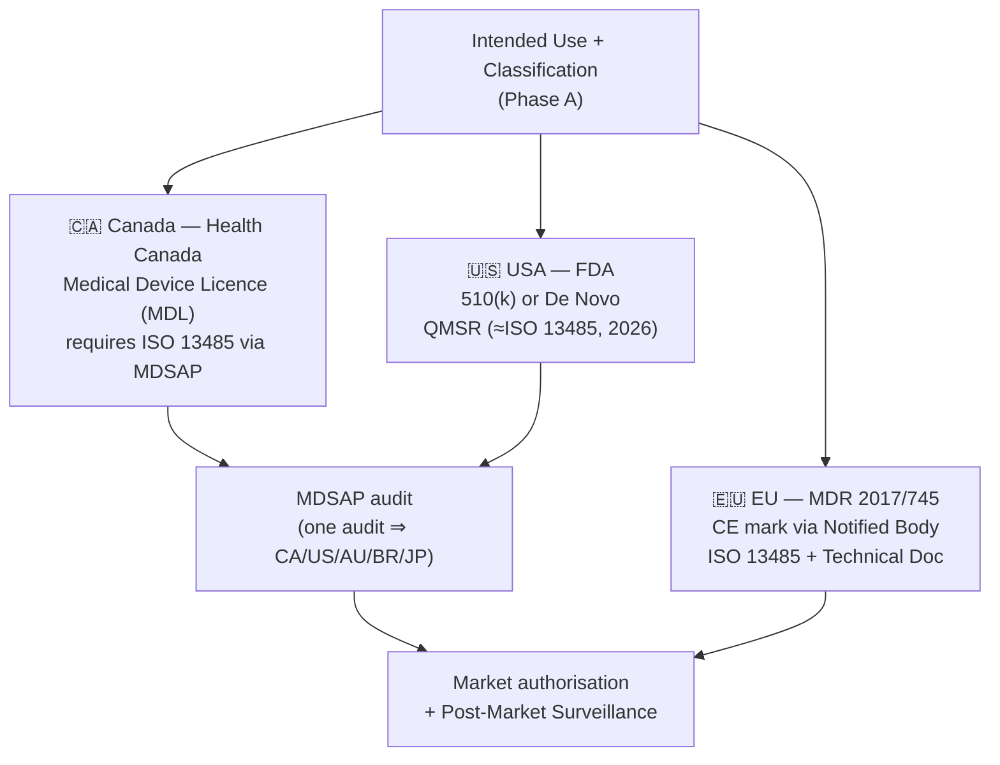
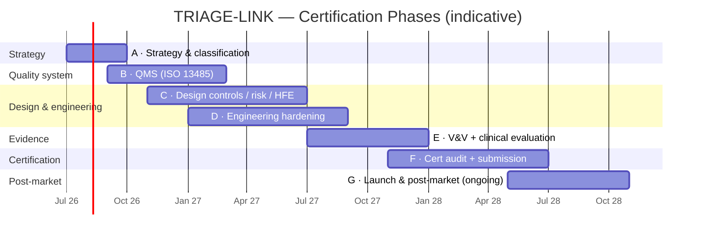

# TRIAGE-LINK — Medical Device Certification Roadmap

> **Purpose.** A phased plan to take TRIAGE-LINK from an offline-first **prototype** to a
> **commercial, certified Software as a Medical Device (SaMD)** — covering the regulatory
> strategy, quality management system, standards-compliant engineering, clinical evaluation,
> certification audits, and post-market obligations.
>
> **This complements `docs/ROADMAP.md`** (the engineering build plan: prototype → production
> system). That roadmap delivers the *capabilities*; this one wraps them in the *regulated
> process and evidence* a certified medical device requires. Cross-references are noted as
> _(build: Phase N)_.
>
> ⚠️ **Not legal/regulatory advice.** Classification and pathways are product-, claim-, and
> market-specific. Engage a regulatory affairs professional, an ISO 13485 registrar, and (for
> EU) a Notified Body **early** — these decisions shape cost and timeline more than any code.

---

## Table of contents

1. [The one decision that drives everything](#1-the-one-decision-that-drives-everything)
2. [Intended use & device classification](#2-intended-use--device-classification)
3. [Target markets & regulatory pathways](#3-target-markets--regulatory-pathways)
4. [The standards stack](#4-the-standards-stack)
5. [Gap assessment — prototype vs. certified](#5-gap-assessment--prototype-vs-certified)
6. [Phased certification roadmap](#6-phased-certification-roadmap)
7. [Phase timeline](#7-phase-timeline)
8. [Documentation & evidence artifacts](#8-documentation--evidence-artifacts)
9. [Organisation & roles](#9-organisation--roles)
10. [Quality / decision gates](#10-quality--decision-gates)
11. [Mapping: engineering roadmap → certification workstreams](#11-mapping-engineering-roadmap--certification-workstreams)
12. [Indicative cost & timeline](#12-indicative-cost--timeline)
13. [Key risks & mitigations](#13-key-risks--mitigations)
14. [Glossary](#14-glossary)

---

## 1. The one decision that drives everything

**Is TRIAGE-LINK a medical device?** A SaMD is software intended for a *medical purpose*
(diagnosis, treatment, prevention, monitoring). Two paths from today's prototype:

| If the intended use is… | Then… |
|---|---|
| **A documentation / record-keeping tool** (captures and transmits what a clinician decides) | May fall **outside** SaMD scope — far lighter regulatory burden. Most defensible commercial first step. |
| **Software that drives or informs clinical decisions** (e.g. computes triage category, burn TBSA, or flags acuity that clinicians act on) | **Is** SaMD — full design controls, ISO 14971, IEC 62304, clinical evaluation, certification. |

> **Today's prototype already computes acuity-adjacent outputs** (Lund–Browder burn **TBSA**,
> START triage tagging). If those outputs are *presented as clinical guidance*, the product
> trends toward SaMD. **Define the intended use statement precisely** — it determines
> classification, and classification determines everything below. This roadmap assumes the
> **SaMD** path (the higher bar); de-scope if the documentation-tool path is chosen.

**Action:** write a one-paragraph **Intended Use / Indications for Use** statement and an
**intended-user / intended-environment** description, and record them as the controlling
inputs. Everything downstream traces back to these.

---

## 2. Intended use & device classification

Classification follows the **risk** posed by the software's role: the significance of the
information to a healthcare decision × the state of the healthcare situation (IMDRF SaMD
framework). Likely landing zones (to be confirmed by regulatory assessment):

| Framework | Likely class | Rationale |
|---|---|---|
| **IMDRF SaMD** | Category **II–III** | "Drives/informs clinical management" in a "serious/critical" (emergency) situation pushes the category up |
| **Health Canada** (SOR/98-282) | Class **II** (possibly III) | Software informing triage/treatment in emergencies |
| **US FDA** | Class **II** (510(k) or **De Novo** if no predicate) | Most clinical-decision-support SaMD; some CDS is exempt under the 21st Century Cures Act criteria |
| **EU MDR 2017/745** | Class **IIa/IIb** (Rule 11) | MDR Rule 11 classifies most clinical software ≥ IIa; "serious deterioration" → IIb |

**Emergency / mass-casualty context raises the stakes:** a wrong or lost record can affect a
critical decision, which is exactly what pushes class and evidence requirements upward. Plan
for **Class II at minimum**.

---

## 3. Target markets & regulatory pathways

Pick the **launch market first** (sequence the rest) — each adds a parallel submission track.
Given the Ontario / Ontario Health focus, **Canada is the natural first market.**

| Market | Authorisation | QMS basis | Notes |
|---|---|---|---|
| **Canada** | Medical Device Licence (Class II+) | **ISO 13485 via MDSAP** (mandatory) | MDSAP single audit also satisfies US/AU/BR/JP |
| **USA** | 510(k) clearance, or **De Novo** if novel | **QMSR** (harmonises with ISO 13485, effective 2026) | Identify a predicate device early; De Novo if none |
| **EU/UK** | **CE mark** (EU MDR) / UKCA | ISO 13485 + MDR Technical Documentation | Notified Body capacity is a real schedule risk |

> **Leverage MDSAP:** a single MDSAP audit covers Canada, USA, Australia, Brazil, and Japan —
> the most efficient multi-market QMS strategy.

---

## 4. The standards stack

A certified SaMD is built **to** these standards, with evidence generated **as you go** (not
retrofitted). The core set:

| Standard | Scope | What it forces into the project |
|---|---|---|
| **ISO 13485** | Quality Management System | Document control, design controls, CAPA, supplier control, records |
| **IEC 62304** | Medical device **software** lifecycle | Software safety classification (A/B/C), planning, architecture, unit/integration/system V&V, SOUP/3rd-party management, problem resolution |
| **ISO 14971** | **Risk management** | Risk management file: hazard analysis, risk controls, benefit-risk, residual risk |
| **IEC 62366-1** | **Usability engineering** (human factors) | Use-specification, use-related risk, formative + summative usability validation |
| **IEC 81001-5-1** | Health software **cybersecurity** lifecycle | Secure SDLC, threat modelling, SBOM, vulnerability management |
| **IEC 82304-1** | Health software product safety | Whole-product requirements, validation, accompanying documentation |
| **ISO/IEC 27001** | Information security management | (Often paired) ISMS for the hosted backend |
| **ISO 14155** | Clinical investigation | If a clinical study is needed for evidence |
| **ISO/TR 80002-2** | Software validation | Validation of QMS/process software & tools |

**Privacy & health-data law (parallel, mandatory):** **PHIPA** (Ontario), **PIPEDA** (Canada),
**HIPAA** (US), **GDPR** (EU). Plus **HL7 FHIR conformance** to provincial profiles (already
the product's integration boundary — an asset).

---

## 5. Gap assessment — prototype vs. certified

What exists today vs. what certification requires. (Engineering items cross-ref `docs/ROADMAP.md`.)

| Area | Today (prototype) | Required for certification | Gap |
|---|---|---|---|
| **Intended use / claims** | Implicit ("not for clinical use") | Formal Intended Use, Indications, classification | ★★★ |
| **QMS** | None | ISO 13485 certified QMS | ★★★ |
| **Design controls / DHF** | Ad-hoc docs (good architecture docs exist) | Design History File: inputs→outputs→V&V→traceability | ★★★ |
| **Risk management** | Informal | ISO 14971 risk file, hazard analysis, benefit-risk | ★★★ |
| **Software lifecycle** | Modern TS, tests, CI | IEC 62304 plan, safety class, documented architecture, SOUP list, traceability | ★★ |
| **Usability / HFE** | Functional UI | IEC 62366 use-spec + summative validation with representative users | ★★★ |
| **Cybersecurity** | Fail-closed EHR selection, ATNA audit, idempotent writes, mTLS seam | IEC 81001-5-1 secure SDLC, threat model, SBOM, pen test, vuln mgmt | ★★ |
| **AuthN/AuthZ** | None on PWA | OIDC/SSO, MFA, RBAC, session management _(build: Phase 3)_ | ★★★ |
| **Encryption at rest** | Photos encryptable (opt-in vault) + passphrase-encrypted backups; record text still plaintext | Full encrypted device store + encrypted backend/backups _(build: Phase 3)_ | ★★★ |
| **Audit trail** | EHR access audited (`ehr_audit`, ATNA) | All-PHI CRUD audit, immutable/WORM, time-synced | ★★ |
| **V&V evidence** | ~90 unit/integration tests | Documented, traced system-level V&V to requirements + risk controls | ★★ |
| **Clinical evaluation** | None | Clinical Evaluation Plan/Report; possibly clinical investigation | ★★★ |
| **Labelling / IFU** | README disclaimers | Instructions For Use, labelling, UDI | ★★★ |
| **Post-market** | None | PMS plan, vigilance, complaint handling, PSUR | ★★★ |

**Existing assets that accelerate certification:** framework-free core (clean
requirements/architecture traceability), strong test culture and CI, FHIR-standard
interoperability, the architecture/deployment docs, fail-closed safety design, and per-access
audit. These are real head starts — most prototypes have none.

---

## 6. Phased certification roadmap

Seven phases. Phases **B–D run with engineering in parallel**; the key is that engineering
output is produced **under** the QMS so it counts as evidence.

### Phase A — Regulatory strategy & classification *(months 0–3)*
**Objective:** lock the controlling decisions before scaling spend.
- Author the **Intended Use / Indications for Use**, intended users, and use environment.
- **Classification assessment** (IMDRF + each target market); choose **launch market** & sequence.
- **Regulatory strategy** (pathway per market: MDL / 510(k)/De Novo / CE), predicate search (US).
- Assign **IEC 62304 software safety class** (A/B/C) — drives the depth of all software work.
- Engage a regulatory consultant; select ISO 13485 **registrar**/Notified Body (lead-time matters).
- **Deliverables:** Intended Use statement, Classification rationale, Regulatory Strategy, Project/Quality plan.
- **Exit gate:** classification & pathway signed off; safety class fixed.

### Phase B — Quality Management System (ISO 13485) *(months 2–8)*
**Objective:** stand up the QMS that everything else is produced within.
- Establish the **Quality Manual**, SOPs (document/record control, design control, CAPA,
  supplier/SOUP control, risk management, software development, change control, complaint
  handling, post-market surveillance, release).
- Define org, roles, **Management Representative**; training records.
- Validate process/tool software (ISO/TR 80002-2) — issue tracker, CI, test tools.
- **Deliverables:** Quality Manual + SOP set, training records, validated toolchain.
- **Exit gate:** QMS operational; ready for internal audit. *(Stage-1 readiness.)*

### Phase C — Design controls, risk & usability *(months 4–12)*
**Objective:** build the **Design History File** and risk/usability evidence.
- **Design inputs:** user needs → requirements (functional, performance, safety, security,
  regulatory, interoperability). Trace from the Intended Use.
- **Design outputs:** architecture, interface specs, the codebase — under change control.
- **ISO 14971 risk file:** hazard analysis (incl. emergency-context hazards: lost record,
  wrong-patient match, stale offline data, mis-sync), risk controls, benefit-risk, residual risk.
- **IEC 62366-1 usability:** use-specification, use-related risk analysis, **formative**
  studies, UI/IFU refinement; plan **summative** validation with representative responders.
- **IEC 62304 software file:** development plan, software architecture, detailed design,
  **SOUP list + SBOM**, unit/integration design, anomaly/problem-resolution process.
- **Traceability matrix:** user need ↔ requirement ↔ design ↔ risk control ↔ test.
- **Deliverables:** DHF (inputs/outputs/reviews), Risk Management File, Usability File, Software Dev File, traceability matrix.
- **Exit gate:** design reviews passed; requirements frozen for V&V.

### Phase D — Engineering hardening to standard *(months 6–14, parallel with build roadmap)*
**Objective:** close the technical gaps **as controlled design outputs**.
- **Security (IEC 81001-5-1):** threat model, secure-coding standard, dependency/vuln
  management, secrets management, **penetration test**, security risk assessment.
- **AuthN/AuthZ:** OIDC/SSO + MFA, RBAC least-privilege _(build: Phase 3)_.
- **Encryption:** device store at rest + backend/backups; TLS 1.3; mTLS to EHR (seam exists).
- **Audit:** extend ATNA audit to **all PHI CRUD**, immutable/WORM storage, time sync.
- **Reliability:** backup/restore, DR, the MCI-burst non-functionals _(build: Phase 5)_.
- **Deliverables:** security risk assessment + pen-test report, SBOM, hardened build, updated DHF.
- **Exit gate:** security controls verified; no unmitigated high-severity findings.

### Phase E — Verification, validation & clinical evaluation *(months 12–18)*
**Objective:** prove the device meets requirements and is clinically safe/effective.
- **Verification:** documented unit/integration/system tests **traced** to requirements &
  risk controls (build on existing ~90 tests, formalised under the QMS).
- **Validation:** the product meets user needs in the intended environment (incl. offline & MCI).
- **Summative usability validation** (IEC 62366) with representative users — pass criteria pre-defined.
- **Clinical Evaluation Plan/Report**; decide if a **clinical investigation** (ISO 14155) is
  needed for evidence; assemble real-world / literature evidence.
- **Deliverables:** V&V reports + traceability, Summative Usability Report, Clinical Evaluation Report.
- **Exit gate:** all V&V passed, residual risks acceptable, benefit-risk positive.

### Phase F — Certification & market authorisation *(months 16–24+)*
**Objective:** obtain QMS certification and market clearance.
- **ISO 13485 certification audit** (Stage 1 + Stage 2) via registrar; **MDSAP** if multi-market.
- Compile the **Technical Documentation / submission**:
  - Canada: **MDL** application (Class II+ requires ISO 13485/MDSAP cert).
  - USA: **510(k)** (with predicate) or **De Novo**.
  - EU: **Technical Documentation** + Notified Body conformity assessment → **CE**.
- Respond to deficiency letters / audit findings; close nonconformities.
- **Deliverables:** ISO 13485 certificate, market authorisation(s), approved labelling/IFU, UDI.
- **Exit gate:** cleared/licensed/CE-marked for the launch market.

### Phase G — Launch & post-market *(ongoing)*
**Objective:** sustain compliance in the field.
- **Post-Market Surveillance** plan; **vigilance** (incident/recall reporting per jurisdiction).
- **Complaint handling**, CAPA, periodic safety reporting (**PSUR**/MDR), trending.
- **Change management:** software changes assessed for re-submission/re-validation impact
  (significant-change determination); cybersecurity patch process.
- Surveillance audits (annual ISO 13485 / MDSAP); standards re-certification.
- **Deliverables:** PMS reports, vigilance records, CAPA log, change-control records.
- **Exit gate (continuous):** certification maintained; obligations met.

---

## 7. Phase timeline

> Indicative only — **18–30 months** prototype→cleared for a Class II SaMD is typical;
> EU MDR Notified Body capacity and any clinical investigation are the main schedule risks.

---

## 8. Documentation & evidence artifacts

The **Technical Documentation / Device Master Record** a submission/audit expects:

- Intended Use / Indications for Use; classification rationale
- Device description & specifications; labelling and **Instructions For Use**; **UDI**
- **Design History File** (design inputs, outputs, reviews, transfer)
- **Risk Management File** (ISO 14971): plan, hazard analysis, risk controls, benefit-risk, report
- **Software documentation** (IEC 62304): dev plan, safety classification, architecture,
  detailed design, **SOUP list**, **SBOM**, V&V, anomaly list, release notes
- **Usability Engineering File** (IEC 62366): use-spec, use-related risk, formative + summative reports
- **Cybersecurity file** (IEC 81001-5-1): threat model, security risk assessment, pen-test, vuln-management plan
- **Verification & Validation** reports + **traceability matrix**
- **Clinical Evaluation** Plan/Report (+ clinical investigation records if applicable)
- **QMS records:** management review, internal audits, CAPA, supplier/SOUP control, training
- **Post-Market Surveillance** & vigilance plan; PSUR
- **Declaration of Conformity** (EU) / submission dossiers per market

---

## 9. Organisation & roles

| Role | Responsibility |
|---|---|
| **Management Representative** (ISO 13485) | QMS authority, management review |
| **Regulatory Affairs** | Strategy, classification, submissions, liaison with authorities/NB |
| **Quality Manager** | SOPs, audits, CAPA, document/record control |
| **Software Lead / Architect** | IEC 62304 lifecycle, architecture, SOUP/SBOM |
| **Risk Manager** | ISO 14971 file, hazard analysis, benefit-risk |
| **Human Factors / Usability** | IEC 62366 use-spec, formative/summative studies |
| **Security Lead** | IEC 81001-5-1, threat model, pen-test, vuln management |
| **Clinical Lead** | Clinical evaluation, intended-use clinical input, (investigation) |
| **Privacy Officer** | PHIPA/PIPEDA/HIPAA/GDPR compliance, DPIA |

Small teams combine roles, but **independence of review** (e.g. tester ≠ author for V&V sign-off)
must be preserved.

---

## 10. Quality / decision gates

| Gate | After | Criteria to pass |
|---|---|---|
| **G0 — Go/No-Go** | Phase A | Intended use, classification, pathway, safety class agreed; budget approved |
| **G1 — QMS ready** | Phase B | SOPs effective; tools validated; internal audit clean |
| **G2 — Design frozen** | Phase C | Inputs↔outputs traced; risk file baselined; design reviews passed |
| **G3 — Security verified** | Phase D | Threat model closed; pen-test high-severity findings remediated |
| **G4 — V&V complete** | Phase E | All tests traced & passed; summative usability passed; benefit-risk positive |
| **G5 — Certified** | Phase F | ISO 13485 cert issued; market authorisation granted |
| **G6 — Surveillance** | Phase G (recurring) | PMS active; CAPA closed in SLA; audits maintained |

---

## 11. Mapping: engineering roadmap → certification workstreams

The existing `docs/ROADMAP.md` build phases supply the technical substance; this roadmap puts
them under design control and adds the regulatory/clinical evidence.

| `docs/ROADMAP.md` (build) | Certification phase | Becomes evidence as… |
|---|---|---|
| Phase 0 — Gating decisions | **A** Strategy & classification | Intended Use + classification rationale |
| Phase 1 — Harden & extract core | **C** Design controls | Architecture design outputs + unit V&V |
| Phase 2 — Sync backend | **C/E** Design + V&V | Requirements, design, integration V&V, data-integrity risk controls |
| Phase 3 — Security | **D** Engineering hardening | Security risk assessment, controls, pen-test |
| Phase 4 — Hospital handover | **C/E** Design + V&V | Interoperability requirements + FHIR conformance evidence |
| Phase 5 — Deploy for real | **D/G** Hardening + PMS | Reliability/DR validation; production monitoring feeds vigilance |
| Anatomical body chart | **C/E** Design + V&V | Requirement + verification (and risk if clinically load-bearing) |

---

## 12. Indicative cost & timeline

Rough, market- and scope-dependent — for planning only, **confirm with a regulatory consultant**.

| Workstream | Indicative effort/cost (Class II) |
|---|---|
| Regulatory strategy & consulting | $30–80k |
| ISO 13485 QMS setup + certification | $40–120k (setup) + annual surveillance |
| Risk, usability (HFE), security, pen-test | $60–150k |
| V&V formalisation + clinical evaluation | $50–150k (more with a clinical investigation) |
| Submission fees (per market) | Canada MDL low; FDA 510(k) user fee ~$ tens of k; EU NB fees significant |
| **Total, prototype → first market (Class II)** | **~$250–700k and 18–30 months**, typical |

Class III, EU MDR, or a clinical investigation can multiply both. Sequencing markets
(Canada → US → EU) spreads cost and de-risks.

---

## 13. Key risks & mitigations

| Risk | Impact | Mitigation |
|---|---|---|
| **Mis-scoped intended use** inflates class | Cost/time blow-up | Tighten claims in Phase A; consider documentation-tool framing for v1 |
| Retrofitting evidence onto existing code | Rework, audit findings | Bring engineering under QMS **early** (Phases B–D in parallel) |
| EU MDR Notified Body capacity | Schedule slip | Launch Canada/US first; book NB slot early |
| Clinical evidence insufficient | Submission delay | Clinical Evaluation Plan in Phase A; literature + real-world evidence; investigation only if needed |
| Cybersecurity findings late | Re-validation | Threat model + pen-test in Phase D, not at the end |
| Usability validation fails summative | Redesign late | Formative studies throughout Phase C; pre-defined pass criteria |
| Offline/sync data-integrity hazards | Patient-safety risk | Deterministic merge + audit already designed; formalise as ISO 14971 risk controls |
| Scope creep across markets | Diffuse effort | Single launch market + **MDSAP** to amortise the QMS audit |

---

## 14. Glossary

| Term | Meaning |
|---|---|
| **SaMD** | Software as a Medical Device — software with a medical purpose, not part of a hardware device |
| **IMDRF** | International Medical Device Regulators Forum — the SaMD risk-categorisation framework |
| **ISO 13485** | Quality Management System standard for medical devices |
| **IEC 62304** | Medical device software lifecycle standard (safety classes A/B/C) |
| **ISO 14971** | Medical device risk management standard |
| **IEC 62366-1** | Usability engineering / human factors standard |
| **IEC 81001-5-1** | Health software cybersecurity lifecycle standard |
| **DHF** | Design History File — the record of design controls |
| **SOUP** | Software Of Unknown Provenance — third-party components managed under IEC 62304 |
| **SBOM** | Software Bill of Materials |
| **HFE** | Human Factors Engineering |
| **V&V** | Verification & Validation |
| **MDSAP** | Medical Device Single Audit Program (CA/US/AU/BR/JP) |
| **MDL** | Medical Device Licence (Health Canada) |
| **510(k) / De Novo** | FDA premarket pathways (predicate-based / novel low-moderate risk) |
| **MDR** | EU Medical Device Regulation 2017/745 |
| **Notified Body** | EU third-party conformity-assessment organisation |
| **PMS / PSUR** | Post-Market Surveillance / Periodic Safety Update Report |
| **UDI** | Unique Device Identification |
| **PHIPA / PIPEDA / HIPAA / GDPR** | Health-data privacy laws (Ontario / Canada / US / EU) |
| **CAPA** | Corrective And Preventive Action |

---

*Companion: `docs/ROADMAP.md` (engineering build plan), `docs/MASTER-ARCHITECTURE.md`
(system architecture incl. §10 Security and §11 Regulatory & compliance).*
