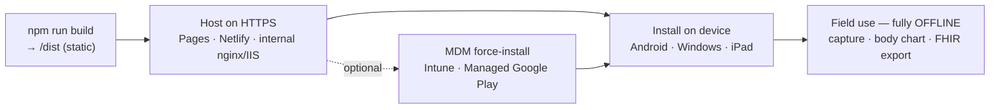

# TRIAGE-LINK — Field Deployment Guide

> How to put TRIAGE-LINK onto responder devices — Android phones/tablets, Windows
> Surface/laptops, and iPhone/iPad — and how to manage a fleet with MDM.

> ⚠️ **Prototype — not for clinical use.** These steps install the current build as
> an app. A real deployment must first add the security controls described in
> `docs/ARCHITECTURE.md` §14 (encryption, auth, audit) before any real patient data
> is entered.

TRIAGE-LINK is an **offline-first Progressive Web App (PWA)**. There is no app-store
binary to sideload. Deployment is three steps:

1. **Build & host** the app once on an HTTPS URL.
2. **Install** it on each device from that URL (one tap/click — it pins like a native app).
3. After the first load it runs **fully offline**; it only needs the network again to receive updates.



---

## 1. Prerequisites

| Requirement | Why |
|---|---|
| **The app served over HTTPS** | PWAs install and run a service worker **only in a secure context**. `https://…` works; `http://192.168.x.x` (plain LAN IP) does **not**. `localhost` / `127.0.0.1` are exempt, for testing only. |
| **A modern browser per platform** | Android → **Chrome** (or Samsung Internet); Windows → **Edge** or **Chrome**; iPhone/iPad → **Safari**. Keep them updated. |
| **~50–100 MB free storage** | For the cached app shell and the local IndexedDB record store. |
| **The built `/dist` folder** | Produced by `npm run build`. This is what you host. |

### Build the app

```bash
npm install
npm run build      # type-checks, then emits the static site to /dist
npm run preview    # optional: serve /dist locally at http://localhost:4173 to test
```

`/dist` is a self-contained static bundle — no server runtime, no database. Whatever you
host it on only needs to serve static files over HTTPS.

---

## 2. Host the app (one-time)

Pick whichever fits your situation. All that matters is a valid HTTPS URL.

| Option | Good for | Notes |
|---|---|---|
| `npm run preview` | Quick local test on the same machine | `localhost` is a secure context, so install works for testing |
| **GitHub Pages** | Free public demo of the prototype | Project sites serve under a sub-path — see the base-path note below. Don't put real PHI on a public host. |
| **Netlify / Vercel** | Free hosting with automatic HTTPS | Drag-and-drop `/dist` or connect the repo; HTTPS is automatic |
| **Internal nginx / IIS** | Real field/enterprise use behind your firewall | Serve `/dist` over HTTPS with a cert your devices trust (public CA or your org CA) |

> **Base-path note (GitHub Pages & sub-path hosting).** If you host at
> `https://<user>.github.io/Emergency-Medical-Support-System/` rather than at a domain
> root, set the matching base in `vite.config.ts` so the service worker scope and asset
> paths resolve:
> ```ts
> export default defineConfig({
>   base: '/Emergency-Medical-Support-System/',
>   // …existing plugins
> })
> ```
> Rebuild after changing this. At a domain root (Netlify/Vercel/your own domain) you can
> leave `base` as the default `'/'`.

---

## 3. Install on Android phones & tablets (Chrome)

1. Open the hosted **HTTPS URL** in **Chrome**.
2. Let it finish loading once — this lets the service worker cache the app for offline use.
3. Tap the **⋮** menu (top-right) → **Install app** (or **Add to Home screen**). Chrome often shows an **Install** banner automatically once the page qualifies.
4. Confirm. A TRIAGE-LINK icon appears on the home screen / app drawer.
5. Launch it from that icon — it opens **full-screen, without browser chrome**, like a native app.

**Samsung Internet:** menu → **Add page to** → **Home screen** works the same way.

**Verify offline:** turn on **Airplane mode**, open the app from its icon, and confirm you
can create a casualty, place injuries, record vitals, and export a FHIR bundle.

---

## 4. Install on Windows Surface & laptops (Edge)

**Microsoft Edge (recommended on Surface):**

1. Open the **HTTPS URL** in Edge and let it load once.
2. Click the **install icon** in the address bar (a monitor with a ↓), **or** **⋯** menu → **Apps** → **Install this site as an app**.
3. Click **Install**. Choose to pin to **Start** / **Taskbar** when prompted.
4. It launches in its **own window** and appears in the Start menu like any installed app.

**Google Chrome on Windows:** click the **install icon** in the address bar → **Install**.

**Surface specifics:** touch and the Surface Pen both work on the body chart exactly as a
mouse does — tap an injury type, then tap the body to drop a marker. No extra setup.

**Verify offline:** disconnect Wi-Fi, then launch the app from the Start menu and run
through a capture.

---

## 5. Install on iPhone & iPad (Safari)

1. Open the **HTTPS URL** in **Safari** (PWA install on iOS is Safari-only).
2. Tap the **Share** button → **Add to Home Screen** → **Add**.
3. Launch from the new home-screen icon; it runs full-screen.

**iOS caveats:** there's no automatic install prompt, and iOS may evict cached data if the
device is very low on storage and the app is unused for a long time. For a managed fleet,
Android or Windows give you firmer control.

---

## 6. Fleet / managed deployment (MDM)

For more than a handful of devices, don't install by hand — push the app from your device
manager so every responder tablet gets it (and the right security policy) automatically.

### Android fleet — Microsoft Intune / Workspace ONE / SOTI + Managed Google Play

- Use **Managed Google Play → "Web apps"** to wrap the hosted URL as an installable web
  app (Google builds a signed WebAPK). Assign it to your responder device group as a
  **required** app so it force-installs.
- For single-purpose tablets, use **dedicated-device / kiosk mode** to lock the device to
  TRIAGE-LINK alone.
- Enforce at the policy level: **device encryption**, **screen lock / biometric**,
  **auto-update**, and **remote wipe** for lost devices.

### Windows / Surface fleet — Microsoft Intune

- Edge supports a **force-install policy for web apps** (`WebAppInstallForceList`).
  Point it at the hosted URL and Edge installs + pins TRIAGE-LINK on managed devices at
  next launch — no user action needed.
- Pair with **BitLocker** (disk encryption), **Windows Hello** (biometric sign-in), and,
  for dedicated Surfaces, **Assigned Access / kiosk** to lock to the single app.

> Exact menu paths in Intune / Managed Google Play change over time — treat the above as
> the mechanism and confirm the current steps in your MDM console's documentation. All you
> ever hand the MDM is the **hosted HTTPS URL**; it does the rest.

---

## 7. Updates

Because it's a PWA, you **never repackage or re-push** to update the app — you just
re-deploy `/dist` to the host:

1. Make changes, run `npm run build`, upload the new `/dist` to the same URL.
2. Next time a device opens the app **with connectivity**, the service worker fetches the
   new version in the background.
3. Depending on how the service worker is configured (`vite-plugin-pwa` `registerType`),
   the update either applies automatically on the next launch (**autoUpdate**) or shows a
   small "new version available" prompt (**prompt**). A quick close-and-reopen guarantees
   the new version is active.

Devices that are offline keep running the last cached version safely and pick up the update
whenever they next reconnect.

---

## 8. Offline-readiness checklist

Run this on **each device** before it goes into the field:

- [ ] App installed from the HTTPS URL and pinned to the home screen / Start menu
- [ ] Opened **once online** so the service worker cached the app shell
- [ ] **Airplane mode on** → app still launches from its icon
- [ ] Can create a casualty, place injuries on the body chart, and record vitals offline
- [ ] **Export FHIR** produces a `…-fhir-bundle.json` download on-device
- [ ] Close and reopen → the saved casualty is still there (IndexedDB persisted)
- [ ] Device encryption, screen lock, and (if managed) MDM enrolment are on

---

## 9. Device hardening (required before real PHI)

These are **operating-system / MDM** controls, not app features — but they are what makes a
device safe to hold patient data. They map directly to `docs/ARCHITECTURE.md` §14.

| Control | Android | Windows / Surface | iPad |
|---|---|---|---|
| **Encryption at rest** | File-Based Encryption (on by default) | **BitLocker** | Data Protection (on by default) |
| **Screen lock / biometric** | PIN + fingerprint/face | **Windows Hello** | Passcode + Face/Touch ID |
| **Remote wipe** | via MDM | via Intune | via MDM |
| **Auto-update OS & browser** | Managed Google Play | Intune / Windows Update | MDM |
| **Single-app lock (optional)** | Kiosk / dedicated device | Assigned Access kiosk | Guided Access / kiosk |

---

## 10. Quick reference

| Device | Browser | Install path | Offline after install |
|---|---|---|---|
| **Android phone / tablet** | Chrome | ⋮ → **Install app** | Yes |
| **Windows Surface / laptop** | Edge | ⋯ → Apps → **Install this site as an app** | Yes |
| **Windows laptop** | Chrome | Address-bar **install icon** | Yes |
| **iPhone / iPad** | Safari | Share → **Add to Home Screen** | Yes (with iOS storage caveats) |

> The one rule that catches everyone: the app must be reached over **HTTPS** (or
> `localhost`) for installation to be offered. Plain `http://` LAN addresses will load the
> page but won't let it install or work offline.
