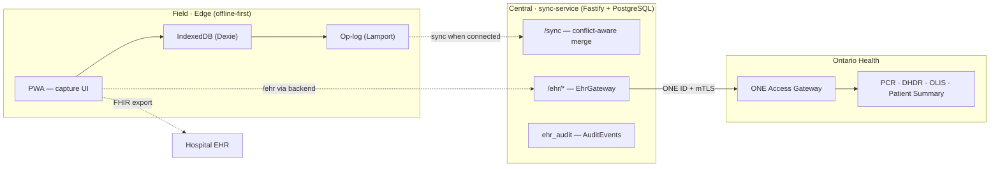
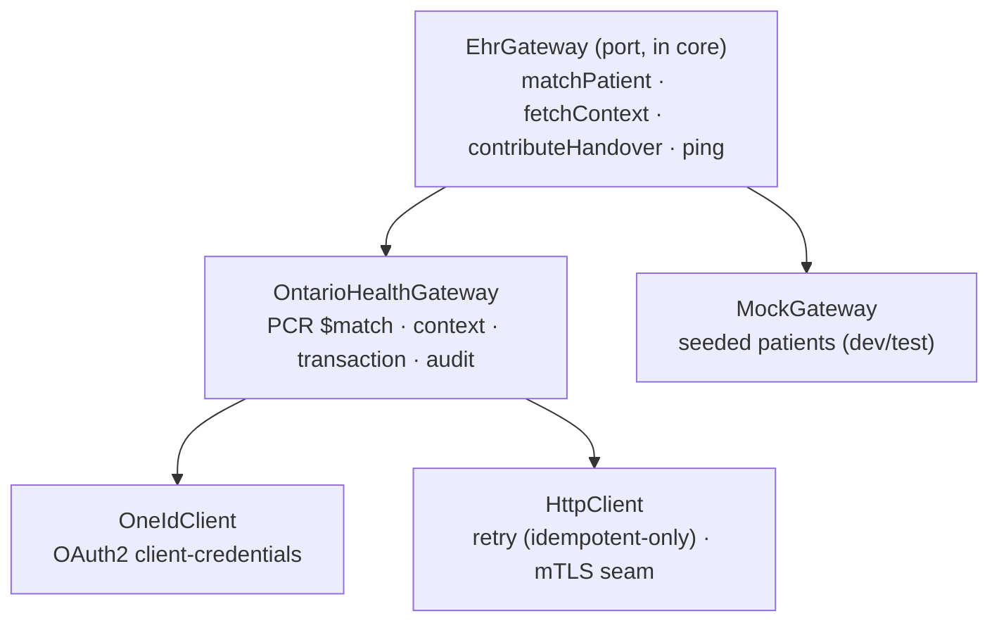

# TRIAGE-LINK — Master Technical Architecture

> **Project:** TRIAGE-LINK (repo: `Emergency-Medical-Support-System`)
> **Type:** Offline-first Progressive Web App for casualty care & transport documentation,
> with a conflict-aware sync backend and a provincial-EHR integration layer (Ontario Health).
> **Status:** ⚠️ **Prototype — not a medical device and not for clinical use.** Several
> production concerns (auth, encryption at rest, EHR onboarding) are designed-for but not
> production-hardened; this is called out per section.

This is the **master** architecture document. It consolidates the system into the sections
below. Two companion documents go deeper on specific areas and remain authoritative there:

- `docs/ARCHITECTURE.md` — narrative "as-built vs target" design, body-model internals, diagrams.
- `docs/DEPLOYMENT.md` — environment-by-environment deployment detail.

---

## Table of contents

1. [Overview](#1-overview)
2. [Requirements](#2-requirements)
3. [Use cases](#3-use-cases)
4. [Technology used](#4-technology-used)
5. [System architecture](#5-system-architecture)
6. [Data model](#6-data-model)
7. [Implementation](#7-implementation)
8. [Test cases](#8-test-cases)
9. [Deployment](#9-deployment)
10. [Security & privacy](#10-security--privacy)
11. [Regulatory & compliance](#11-regulatory--compliance)
12. [Roadmap](#12-roadmap)
13. [Glossary](#13-glossary)

---

## 1. Overview

TRIAGE-LINK is a digital replacement for the paper triage tag used by emergency responders
at accident scenes and mass-casualty incidents (MCIs). A single responder — often with no
network connectivity — captures a casualty's identity, injuries (marked on a 2-D body
chart), vital signs, and treatments at the point of care, then hands the record to a
receiving hospital as a standards-compliant **HL7 FHIR R4** bundle.

The system has three cooperating tiers:

| Tier | What it is | Connectivity |
|---|---|---|
| **Field client** | The PWA — capture UI, on-device store, op-log | Works fully offline |
| **Sync service** | Fastify + PostgreSQL backend: conflict-aware record reconciliation + EHR gateway | Online |
| **Provincial EHR** | Ontario Health's province-wide EHR via the ONE Access Gateway | Online, gated |

The defining constraint is **offline-first**: the scene may have no signal, so the device is
authoritative locally and reconciles later. The defining interoperability choice is **HL7
FHIR R4**, so hospital EHRs and the provincial registry understand the record without a
bespoke format. The interface is **trilingual** (English / French / Arabic, including
right-to-left), so a responder captures and hands over in their own language.

### Primary actors

| Actor | Role |
|---|---|
| **Field responder** (paramedic, medic, first-aider) | Captures the casualty record on a phone/tablet, usually offline |
| **Receiving facility** (hospital EHR) | Imports the FHIR bundle at handover |
| **Provincial EHR** (Ontario Health) | Confirms patient identity (PCR), supplies clinical context, receives contributions |
| **System operator** | Runs the sync service; reviews the EHR access audit trail |

---

## 2. Requirements

### 2.1 Functional requirements

| ID | Requirement | Status |
|---|---|---|
| **F-1** | Capture patient identity ("tombstone": name, DOB, sex, MRN, blood type, NOK) | ✅ |
| **F-2** | Record incident details (time, mechanism, location, START triage category, age band) | ✅ |
| **F-3** | Mark injuries on an interactive anterior/posterior body chart with auto-detected body region | ✅ |
| **F-4** | Per-injury severity and notes; injury-type palette | ✅ |
| **F-5** | Record timestamped vitals (HR, BP, RR, SpO₂, GCS, pain) | ✅ |
| **F-6** | Log treatments (type, detail, place, provider) | ✅ |
| **F-7** | Age-adjusted burn TBSA (Lund–Browder) computed live from burn injuries | ✅ |
| **F-8** | Persist all data on-device; auto-save with no explicit "save" step | ✅ |
| **F-9** | Manage multiple casualties; triage board; printable casualty summary | ✅ |
| **F-10** | Export a FHIR R4 bundle for hospital handover | ✅ |
| **F-11** | Multi-device sync with deterministic, conflict-aware merge (no lost writes) | ✅ (backend) |
| **F-12** | Verify casualty identity against the provincial client registry (PCR `Patient/$match`) | ✅ |
| **F-13** | Pull clinical context (meds/allergies/labs) for a resolved patient | ✅ |
| **F-14** | Contribute a casualty handover to the EHR (write) where entitled | ✅ |
| **F-15** | Durable, queryable audit trail of every EHR access (ATNA AuditEvent) | ✅ |
| **F-16** | Multilingual UI (English / French / Arabic) with persistent choice and right-to-left layout; selectable via in-app toggle or a `?lang=` URL switch | ✅ |
| **F-17** | Live time-since-injury clock (`T+` elapsed) on the acuity glance, triage board, and casualty card | ✅ |
| **F-18** | Handover sign-off (receiving clinician + facility, auto-timestamped) reflected on the saved list, triage board, and casualty card | ✅ |
| **F-19** | Triage board search (name / ID / mechanism / location) and on-scene vs handed-over filtering | ✅ |
| **F-20** | Guided, voiced onboarding tour; offline EHR Test Lab (dev/QA) exercising the real gateway in-browser | ✅ |

### 2.2 Non-functional requirements

| Attribute | Target |
|---|---|
| **Offline capability** | 100% of capture functions usable with zero connectivity |
| **Portability** | One codebase runs on any modern browser; installs to the home screen |
| **Sync latency** | Record reaches the central tier within seconds of connectivity returning |
| **Data integrity** | No silent data loss; all merge conflicts resolved deterministically and audited |
| **MCI burst** | Many concurrent responders without capture-side degradation |
| **Handover time** | Scan/transfer-to-EHR in seconds, not minutes |
| **Availability** | ≥ 99.9% for central services; handover path prioritised |
| **Auditability** | Every PHI/EHR access is logged immutably — who, what, when |
| **Fail-closed safety** | The system never serves fabricated data on misconfiguration |

### 2.3 Constraints & assumptions

- **No PHI leaves the device** unless the user explicitly exports a bundle or sends to the EHR.
- The PWA **cannot** hold ONE ID secrets or present a client certificate — all credentialed
  EHR traffic goes through the backend.
- Connecting to Ontario's **production** EHR requires Health Information Custodian
  onboarding, ONE ID credentials, mutual TLS, and conformance testing — out of scope for the
  prototype, but the interfaces are built to accept them as configuration.

---

## 3. Use cases

### UC-1 — Capture a casualty offline
**Actor:** Field responder. **Precondition:** No connectivity.
1. Responder opens the installed PWA (loads from the service-worker cache).
2. Enters tombstone + incident; taps the body chart to mark injuries; records vitals and treatments.
3. Each edit re-renders immediately and auto-saves to IndexedDB after a 400 ms debounce.
**Outcome:** A durable `CasualtyRecord` on-device; no data lost if the app closes.

### UC-2 — Hand over to a hospital via FHIR export
**Actor:** Field responder → receiving facility.
1. Responder taps **Export FHIR ↓**.
2. `toFhirBundle(record)` produces a FHIR R4 `collection` bundle; the browser downloads it.
**Outcome:** A standards-compliant bundle the hospital EHR can ingest. Pure client-side; nothing transmitted.

### UC-3 — Reconcile the same casualty across devices
**Actor:** Two responders editing one casualty.
1. Each device journals edits as Lamport-ordered **ops** in an append-only log.
2. On connectivity, `POST /sync` ingests ops idempotently and folds them with the deterministic resolver.
3. Edits to different fields merge cleanly; same-target edits pick a Lamport winner and the loser is **retained** and reported as a conflict.
**Outcome:** Byte-identical converged state on every replica; full audit trail; no lost writes.

### UC-4 — Verify identity against the provincial registry (PCR)
**Actor:** Field responder (via backend).
1. Responder enters a health-card number (or name + DOB) and taps **⊕ Verify identity against PCR**.
2. The PWA calls `POST /ehr/patient/$match`; the backend builds a FHIR `Parameters`, calls PCR via the ONE Access Gateway, and returns graded matches.
3. Responder applies a matched identity onto the record (promotes the registry id/health-card number).
**Outcome:** Confirmed patient identity; every query audited.

### UC-5 — Pull clinical context for a known patient
**Actor:** Field responder (via backend).
1. After a resolved match, responder taps **Load clinical context**.
2. `GET /ehr/patient/:id/context` fetches meds/allergies/labs (DHDR/OLIS/Patient Summary), merging entitled repositories into one collection bundle (repositories the caller isn't entitled to are skipped).
**Outcome:** Allergies/medications visible at the point of care.

### UC-6 — Contribute a handover to the EHR
**Actor:** Field responder (via backend), where entitled.
1. Responder taps **Send to EHR ↑**.
2. `POST /ehr/handover` maps the record to an Ontario-profiled **transaction** bundle (OHIP identifier) and POSTs it. Writes are **never retried** (no duplicate contribution).
**Outcome:** The handover is contributed (or a clear failure is surfaced); audited as a create.

### UC-7 — Review the EHR access audit trail
**Actor:** System operator.
1. Operator calls `GET /ehr/audit` (optionally `?patient=`).
2. The service returns persisted ATNA AuditEvents (action/outcome/agent/patient/query + full FHIR resource), newest first.
**Outcome:** Accountable, durable record of every provincial-EHR access.

### UC-8 — Document in the responder's language (multilingual / RTL)
**Actor:** Field responder. **Precondition:** None (works fully offline).
1. The interface loads in the responder's language — chosen from the header 🌐 toggle (cycles English → French → Arabic) or forced by a `?lang=ar` URL switch (handy for kiosks/QR links). The choice persists to `localStorage`, so it sticks until switched.
2. For Arabic, the document direction flips to right-to-left; the whole clinical UI, the guided tour voice-over, the anatomical region names, and the printable casualty card render in-language. Patient data (names, IDs, treatment/injury *keys*) stays language-neutral so the record and its FHIR export are unaffected.
**Outcome:** A field responder captures and hands over entirely in their own language without changing the underlying record.

### UC-9 — Sign off and share a handover
**Actor:** Field responder → receiving facility.
1. At the receiving end, the responder enters the receiving clinician and facility and taps **✓ Mark handed over**; the time is stamped automatically. The casualty is now flagged "handed over" on the saved list, on the triage board (filterable, with who/where/when on the card), and on the casualty card.
2. Signing closes the FHIR **Encounter** (`period.end`, an attender participant, the receiving `serviceProvider`) and emits a **Provenance** documenting the transfer. The responder can **⤳ Share handover** to download a focused FHIR slice — Patient + Encounter + Provenance only.
**Outcome:** An auditable, standards-based record of *who took over care, when, and where* — exportable on its own or as part of the full bundle.

---

## 4. Technology used

### 4.1 Field client (PWA)

| Concern | Choice | Version | Rationale |
|---|---|---|---|
| UI framework | **React + TypeScript** | 18.3 | Component model for capture UI; static typing across the domain |
| Build / dev | **Vite** | 8.1 | Fast dev server; simple static production build |
| Offline storage | **IndexedDB** via **Dexie** | 4.0 | Durable, async, typed on-device store; no backend needed |
| Offline shell | **vite-plugin-pwa** (Workbox) | 1.3 | Service worker precaches the app for offline use |
| Localization | In-house **React-context i18n** (EN/FR/AR, RTL) | — | No dependency; offline-first; flat dictionaries with English fallback; `?lang=` URL switch |
| Interop | **HL7 FHIR R4** | — | De-facto hospital/registry exchange standard |

### 4.2 Backend (sync service + EHR gateway)

| Concern | Choice | Version | Rationale |
|---|---|---|---|
| HTTP server | **Fastify** | 5.8 | Lightweight, typed, fast |
| System of record | **PostgreSQL** via **pg** | 8.12 | Durable relational store for ops/snapshots/audit |
| EHR auth | **ONE ID** (OAuth 2.0 client-credentials / OIDC) | — | Ontario Health's identity & access service |
| EHR transport | **ONE Access Gateway** + mutual TLS | — | The front door to Ontario's provincial repositories |
| Identifiers | **OHIP health card** (FHIR NamingSystem) | — | Provincial patient identity |

### 4.3 Shared & tooling

| Concern | Choice | Version |
|---|---|---|
| Language | **TypeScript** | 5.6 |
| Monorepo | **npm workspaces** | — |
| Tests | **Vitest** (+ **pg-mem** for in-memory Postgres) | 4.1 / 3.0 |
| CI/CD | **GitHub Actions** (CI + Pages deploy) | — |

There are intentionally **no heavyweight runtime dependencies** in the core (no FHIR library):
the domain model, FHIR mapping, op-log, and EHR port are hand-written framework-free TypeScript.

---

## 5. System architecture

### 5.1 Three-tier topology



### 5.2 Monorepo packages & dependency direction

Dependencies point **inward**: UI → core; backend → core; nothing depends on the UI.

```
@triage-link/core          framework-free: domain, fhir, sync (op-log), ehr (port + Ontario mappings)
@triage-link/ehr-gateway   server-side EHR adapters: ONE ID, OntarioHealthGateway, MockGateway, HttpClient
@triage-link/sync-service  Fastify + PostgreSQL: /sync, /ehr/*, audit store
src/ (root)                the PWA app — consumes @triage-link/core
```

### 5.3 EHR integration as a port/adapter

The app depends only on the provider-agnostic `EhrGateway` interface (in core). Ontario Health
is one concrete adapter; `MockGateway` backs dev/tests. Adding a province = implementing the
same interface — nothing upstream changes.



---

## 6. Data model

### 6.1 The casualty record (single source of truth)

The entire clinical record for one patient is one `CasualtyRecord`
(`packages/core/src/domain/types.ts`):

```
CasualtyRecord
├── id                      stable case ID (also seeded as the MRN)
├── tombstone   Tombstone   name, dob, sex, mrn, bloodType, address, nextOfKin, nextOfKinPhone
├── incident    Incident    injuryTime, mechanism, location, triage, ageBand
├── injuries    Injury[]    view, x/y, region, type, severity, notes
├── vitals      VitalSign[] takenAt + hr/bp/rr/spo2/gcs/pain
├── treatments  Treatment[] performedAt, type, detail, place, provider
├── handover    Handover?   at, clinician, facility (null until handover)
├── createdAt   number
└── updatedAt   number
```

- **One record = one unit of sync** (the op-log reconciles per record).
- **"Tombstone" = stable identity layer**, separated from the episode-specific `incident`,
  mirroring how hospital systems separate a Patient from an Encounter.
- **Triage** uses START — immediate (red) / delayed (yellow) / minor (green) / deceased (black).

### 6.2 Op-log (sync) model

Each edit becomes an immutable **op** — `scalar` (a field path), `item-put`, or `item-remove`
— carrying a **Lamport clock**, a `clientId`, and a unique id (idempotency key).
`resolve(recordId, ops)` folds ops in canonical order `(lamport, clientId, id)`, so any two
replicas with the same ops compute byte-identical state. Losing ops are retained and reported
as `ConflictReport`s.

### 6.3 FHIR mapping (handover)

`packages/core/src/fhir/mapping.ts` maps the record to a FHIR R4 bundle:

| Domain concept | FHIR resource | Notes |
|---|---|---|
| Tombstone | `Patient` | name, gender, birthDate, NOK contact; identifier `urn:triage-link:case` |
| Incident/episode | `Encounter` | `class=EMER`; status `in-progress`→`finished`; mechanism → `reasonCode`. A signed handover adds `period.end`, an ATND attender participant, and the receiving `serviceProvider` |
| Handover | `Provenance` | emitted only once signed — `recorded` time, a `TRANSFER` activity, a custodian agent (clinician `onBehalfOf` facility) targeting the Encounter |
| Injury | `Condition` | category `injury`; `bodySite` = region+view; severity; notes |
| Vital | `Observation` | category `vital-signs`; **LOINC-coded**; value + unit |
| Treatment (non-drug) | `Procedure` | status `completed`; performer; detail + place |
| Treatment (drug) | `MedicationAdministration` | when the intervention matches `/medication/i` |

`toFhirBundle` emits the full `collection`; **`toHandoverBundle`** returns the focused slice
(Patient + Encounter + Provenance) behind the **⤳ Share handover** action.

### 6.4 Ontario-profiled FHIR (registry)

`packages/core/src/ehr/ontario.ts`:
- **`ONTARIO_SYSTEMS`** — OHIP health-card identifier systems.
- **`buildPatientMatchParameters`** — FHIR `Parameters` for PCR `Patient/$match`.
- **`parsePatientMatchBundle`** — reads the authoritative FHIR `match-grade` extension
  (falling back to the numeric `search.score` only when absent); resolves identity only on a
  single `certain` candidate.
- **`toOntarioContributionBundle`** — a FHIR **transaction** bundle with the OHIP patient
  identifier for contribution.
- **`buildAccessAuditEvent`** — an ATNA `AuditEvent` per access.

### 6.5 Persistence schema (PostgreSQL)

| Table | Purpose |
|---|---|
| `ops` | Append-only operation log (idempotent ingest) |
| `snapshots` | Resolved per-record state |
| `audit` | Sync op/conflict events (op-ingested, conflict-resolved) |
| `ehr_audit` | EHR-access AuditEvents — full FHIR resource + queryable columns (action/outcome/agent/patient/query) |

---

## 7. Implementation

### 7.1 Field client (`src/`)

- **`App.tsx`** — capture UI; immutable state mutators; 400 ms debounced auto-save via `recordRepo`;
  the handover sign-off panel and the FHIR export / share-slice downloads.
- **`i18n.tsx`** — in-house React-context i18n: flat EN/FR/AR dictionaries with English fallback,
  `t(key, params)`, `regionLabel()` for localised anatomy, a `?lang=` URL switch that wins over the
  persisted choice, and `document.dir = rtl` for Arabic. `useNow.ts` drives the live elapsed clock.
- **`components/BodyChart.tsx`** — anterior/posterior injury-marking SVG; the same polygons are
  drawn and hit-tested, so the figure and tappable regions never drift.
- **`components/PcrVerify.tsx`** — PCR identity verification UI in the Tombstone panel: builds the
  query from the tombstone, lists graded matches, applies a chosen identity, loads context.
- **`components/TriageBoard.tsx`, `CasualtySummary.tsx`, `Elapsed.tsx`** — multi-casualty board
  (searchable, on-scene / handed-over filter, handover detail per card); printable AT-MIST card; the
  live time-since-injury clock.
- **`db/` (Dexie)** — `records` + append-only `ops` + `meta` (clientId + Lamport); `repository.ts`
  journals ops in the same transaction as the record write.
- **`ehr/client.ts`** — browser client for the backend EHR routes (`VITE_EHR_BASE_URL`), with an
  offline/unreachable error path; the PWA never calls Ontario directly.

### 7.2 Core (`packages/core/`)

Framework-free, built to `dist/` (ESM + `.d.ts`) and consumed by both the PWA and the backend:
- `domain/` — `CasualtyRecord` and sub-types; injury catalog; body model + region hit-testing; burn TBSA; id generation.
- `fhir/` — minimal R4 types; `toFhirBundle`.
- `sync/` — `diffToOps`, `mergeOps`, `resolve` (deterministic Lamport-ordered fold).
- `ehr/` — `EhrGateway` port, `PatientIdentity`/`MatchResult`/`ContributionResult` types, typed `EhrError`, `identityFromTombstone`, and the Ontario mappings (§6.4).

### 7.3 EHR gateway (`packages/ehr-gateway/`)

- **`OntarioHealthGateway`** — implements `EhrGateway` against the ONE Access Gateway:
  - `matchPatient` → PCR `Patient/$match` (POST, opted-in as idempotent → retryable).
  - `fetchContext` → searches configured repositories `{type}?patient={id}`, skips 403/404 (not entitled), merges into one collection bundle.
  - `contributeHandover` → POSTs an Ontario transaction bundle, **no retry** (no duplicate write), audited as action `C`.
  - `ping` → CapabilityStatement.
  - Emits an ATNA `AuditEvent` on every access; transparent token refresh on 401.
- **`OneIdClient`** — OAuth 2.0 client-credentials token client; caches the token and
  **coalesces concurrent refreshes** onto a single in-flight fetch.
- **`HttpClient`** — typed `EhrError`s; exponential-backoff retries **gated to idempotent
  requests only** (GET, or explicit opt-in) so writes are never replayed; an mTLS `dispatcher` seam.
- **`MockGateway`** — in-memory provider with seeded patients/context; records contributions.

### 7.4 Sync service (`packages/sync-service/`)

- **`app.ts` / `buildApp`** — wires routes; EHR routes mount only when a gateway is injected.
- **`ops-store.ts`** — append-only ops/snapshots/audit over a `Queryable` seam (prod `pg`, tests `pg-mem`).
- **`ehr-routes.ts`** — `GET /ehr/health`, `POST /ehr/patient/$match` (body validated),
  `POST /ehr/handover`, `GET /ehr/patient/:id/context`, `GET /ehr/audit`; maps `EhrError` codes to HTTP status.
- **`ehr-audit-store.ts`** — `ehr_audit` table + `EhrAuditStore` (record/list, patient filter).
- **`server.ts`** — production entrypoint; **fail-closed** EHR provider selection (see §9.3).

### 7.5 HTTP API summary

| Method & path | Purpose |
|---|---|
| `GET /health` | Liveness |
| `POST /sync` | Ingest ops idempotently; return resolved state + ops |
| `GET /sync/:recordId` | Snapshot + op-log + audit for a record |
| `GET /ehr/health` | EHR provider liveness/auth probe |
| `POST /ehr/patient/$match` | Resolve identity against PCR |
| `GET /ehr/patient/:id/context` | Pull meds/allergies/labs |
| `POST /ehr/handover` | Contribute a handover (write) |
| `GET /ehr/audit` | Read the EHR access audit trail |

---

## 8. Test cases

All suites run under **Vitest**; the backend uses **pg-mem** (in-memory PostgreSQL) so DB tests
run with identical SQL and no external service. **146 tests pass** across the workspaces
(core 68, field client 32, sync 27, EHR gateway 19).

### 8.1 Core (`packages/core/test/`, 68 tests)

| Suite | Covers |
|---|---|
| `fhir-mapping.test.ts` | Record → FHIR bundle: Patient/Encounter/Condition/Observation (LOINC)/Procedure/MedicationAdministration; **handover closes the Encounter (`period.end`, attender, serviceProvider) and emits a Provenance**; `toHandoverBundle` slice |
| `elapsed.test.ts` | Time-since-injury maths — elapsed parsing (null on empty/future) and compact `T+` formatting with localisable units |
| `sync.test.ts` | `diffToOps` / `mergeOps` / `resolve` — deterministic ordering, conflict retention, convergence |
| `regions.test.ts` | Body-region hit-testing + anatomical sidedness |
| `injuries.test.ts`, `types.test.ts`, `id.test.ts` | Catalog, factories, id generation |
| `ehr.test.ts` | `identityFromTombstone`; `$match` Parameters; **match-grade extension is authoritative**; `certainly-not` with a high score does not resolve; AuditEvent builder |

### 8.1b Field client (`test/`, 32 tests, jsdom)

| Suite | Covers |
|---|---|
| `app.test.tsx` | Core capture flows; vitals + GCS; AT-MIST card; DOB → age; calendar popup; triage from the header; **language toggle persists**; **`?lang=ar` URL switch flips to Arabic + RTL**; **handover sign-off → confirmation → undo** |
| `board.test.tsx` | Triage-board search (`matchesQuery`) and the on-scene / handed-over filter; handover detail on cards |
| `i18n.test.ts` | **EN/FR/AR dictionary parity** (no missing keys / English leaks); language cycle; RTL flag; region-name localisation incl. Arabic |
| `ehr-console.test.tsx`, `db.integration.test.ts` | EHR Test Lab console; IndexedDB repository round-trips |

### 8.2 EHR gateway (`packages/ehr-gateway/test/`, ~19 tests)

| Suite | Covers |
|---|---|
| `http.test.ts` | Idempotent GET retries on 503; **non-idempotent POST is not retried**; explicit opt-in retries; non-retryable 403 |
| `one-id.test.ts` (within suite) | Client-credentials token + caching; **concurrent refreshes coalesce to one fetch** |
| `ontario-health-gateway.test.ts` | Authenticated `$match` + parse; underspecified query rejected pre-flight; **401 → refresh + retry once**; context merge skipping 403; **contribution is a transaction bundle, not retried**; failure audited |
| `mock-gateway.test.ts` | Certain/probable/no-match; seeded context; contribution recorded |

### 8.3 Sync service (`packages/sync-service/test/`, 27 tests)

| Suite | Covers |
|---|---|
| `sync.integration.test.ts` | Two offline clients converge through `/sync`; idempotent ingest; conflict audit |
| `ehr-routes.integration.test.ts` | `/ehr/health`; `$match` resolve + **400 on non-object body**; context bundle; **handover + 400 without id**; EHR routes unmounted when no gateway; **end-to-end audit** (match → persisted → `GET /ehr/audit`) |
| `ehr-audit.test.ts` | Persist/read AuditEvent with extracted columns; patient filter + newest-first; limit cap |

### 8.4 Test strategy

- **Deterministic by construction** — injected clocks/fetch (no real time/network/DB).
- **Same code path in mock and prod** — `MockGateway` round-trips through the production parser.
- **Adversarial paths covered** — token expiry, 401/403/503, malformed bundles, oversized limits, no-double-write on failed writes.

---

## 9. Deployment

### 9.1 Field client (static PWA)

`npm run build` type-checks and emits a self-contained static `/dist` bundle; the service
worker makes it work offline after first load. Deploy to any static host/CDN:

- **GitHub Pages** — `.github/workflows/deploy-pages.yml` builds with `GITHUB_PAGES=true`
  (sets the `/Emergency-Medical-Support-System/` base path) and publishes `dist/` on push to `main`.
- **Netlify / S3 / nginx** — drop the `dist/` folder; base path stays `/`.
- **`VITE_EHR_BASE_URL`** (build-time) points the PWA at the backend EHR routes (empty = same origin).

### 9.2 Sync service (container)

- Run `node --experimental-strip-types src/server.ts` (or compile first).
- **`DATABASE_URL`** — PostgreSQL connection string; `migrate()` + `migrateEhrAudit()` create tables on boot.
- **`PORT`** — listen port (default 8080).
- Stateless and horizontally scalable; PostgreSQL is the managed stateful tier.

### 9.3 EHR provider configuration (fail-closed)

`server.ts` selects the EHR adapter from the environment and **fails closed** so fabricated
mock data is never served by accident:

| Condition | Result |
|---|---|
| All Ontario vars present | Real `OntarioHealthGateway` |
| Some but not all present | **Throws at startup** (catches a misconfigured prod deploy) |
| None present + `EHR_ALLOW_MOCK=true` | `MockGateway` (explicit dev opt-in) |
| None present | EHR routes are **not mounted** |

| Variable | Meaning |
|---|---|
| `ONE_ID_TOKEN_URL` | ONE ID OIDC token endpoint |
| `ONE_ID_CLIENT_ID` / `ONE_ID_CLIENT_SECRET` | client-credentials |
| `ONE_ID_SCOPE` | granted scopes (e.g. `pcr/Patient.read`) |
| `OH_FHIR_BASE_URL` | ONE Access Gateway FHIR base |
| `OH_AGENT_ID` | requesting clinician id for the audit trail |
| `EHR_ALLOW_MOCK` | `true` to serve the in-memory mock in dev |

**Mutual TLS:** construct an undici `Agent` with the client certificate and pass it as the
`dispatcher` to `OneIdClient` / `OntarioHealthGateway` (a documented seam in `server.ts`).

### 9.4 CI/CD

`.github/workflows/ci.yml` (on PRs to `main`): `npm ci` → root typecheck → typecheck each of
`core` / `ehr-gateway` / `sync-service` → `npm test` → `npm run build`.

### 9.5 Local development

```bash
npm install        # installs workspaces; builds @triage-link/core (prepare)
npm run dev        # Vite dev server at http://localhost:5173
npm test           # all workspace tests (Vitest)
npm run build      # type-check + production build to /dist

# Backend (mock EHR, no Ontario credentials needed):
EHR_ALLOW_MOCK=true DATABASE_URL=postgres://… \
  npm start --workspace @triage-link/sync-service
```

### 9.6 Target production topology

Stateless services on managed Kubernetes behind a WAF/CDN and load balancer; a message queue
absorbs MCI write bursts and reconnection storms; managed PostgreSQL (primary + replica), a
FHIR server, and a WORM audit store form the data tier. The hospital reaches the FHIR endpoint
via SMART-on-FHIR; the provincial EHR via the ONE Access Gateway with mutual TLS. *(See
`docs/ARCHITECTURE.md` §13 for the full diagram. Not yet implemented.)*

---

## 10. Security & privacy

**Status: prototype.** Today data is local to the device and unencrypted, and there is no
end-user auth on the PWA. A production deployment applies defense-in-depth:

| Domain | Requirement | Priority |
|---|---|---|
| Encryption | TLS 1.3 in transit; AES-256 at rest (device, DB, backups); **mTLS** to the EHR gateway | Must |
| Device security | Full-disk encryption, screen/biometric lock, MDM, remote wipe | Must |
| Authentication | OAuth2/OIDC for users; **ONE ID** for the EHR; SMART-on-FHIR for hospital EHR; MFA for privileged roles | Must |
| Authorisation | RBAC, least privilege; field/dispatch/clinician/admin scoped separately | Must |
| Audit logging | Immutable log of every PHI/EHR access — implemented for EHR access (`ehr_audit`, ATNA AuditEvents) | Must |
| Data minimisation | Collect only what care requires; no PHI in logs/analytics | Must |
| Secrets | ONE ID secrets and client certs live only on the backend; never in the PWA, source, or images | Must |
| Integrity at handover | Signing / provenance on the exported/contributed bundle | Should |

**Implemented today:** fail-closed EHR provider selection; idempotent-only retries (no
duplicate writes); per-access ATNA audit persisted to PostgreSQL; the PWA never holds EHR credentials.

---

## 11. Regulatory & compliance

| Area | What it requires | Applies when |
|---|---|---|
| **PHIPA** (Ontario) | Health-information custodian obligations; consent; audit | Ontario patients / EHR access |
| **Ontario Health onboarding** | HIC agreements, ONE ID, conformance testing, EHR privacy & security | Connecting to the provincial EHR |
| **HIPAA** (US) | Privacy & Security Rules; BAAs; breach notification | US patients/providers |
| **GDPR** (EU/UK) | Lawful basis, data-subject rights, DPIA, residency | EU/UK data subjects |
| **SaMD / IEC 62304** | Design controls, risk management (ISO 14971), validated SDLC | Software drives clinical decisions |
| **HL7 FHIR conformance** | Validate against provincial profiles (PCR IG, Patient Summary) | EHR integration (always) |

> **Decide device classification early.** Whether this is a documentation tool or a
> clinical-decision device changes cost, timeline, and process dramatically.

### Before connecting to production Ontario Health
1. Confirm canonical identifier systems/profiles in `ontario.ts` against the onboarded PCR IG version.
2. Supply ONE ID credentials/scopes and the mTLS client certificate.
3. Wire `onAudit` to the audit store (done) and forward to the enterprise SIEM.
4. Pass conformance testing in the Ontario Health sandbox.

---

## 12. Roadmap

Because the domain, FHIR, and EHR layers are framework-free, several items add without UI changes:

- **Sync hardening** — auth, encryption at rest, incremental per-client cursors, cross-device tombstone deletes.
- **EHR breadth** — richer `fetchContext` (typed DHDR/OLIS/Patient Summary resources); SMART-on-FHIR.
- **Profiles** — validate emitted resources against CA Baseline / Ontario PCR profiles.
- **Handover scanning** — NFC/QR handover + master-patient-index reconciliation.
- **Additional provinces** — new `EhrGateway` adapters behind the same port.
- **React Native client** — reuse `@triage-link/core` unchanged.

---

## 13. Glossary

| Term | Meaning |
|---|---|
| **PWA** | Progressive Web App — installable, offline-capable web app |
| **CasualtyRecord** | The canonical per-patient model; single source of truth |
| **Tombstone** | The stable patient-identity layer (vs the episode-specific incident) |
| **START** | Simple Triage And Rapid Treatment — the red/yellow/green/black scheme |
| **TBSA** | Total Body Surface Area (burns); Lund–Browder age-adjusted |
| **Op-log** | Append-only log of edits, merged with deterministic conflict resolution |
| **Lamport clock** | Logical counter giving a total order for deterministic merge |
| **FHIR** | HL7 Fast Healthcare Interoperability Resources (R4) |
| **PCR** | Provincial Client Registry — Ontario's patient identity registry |
| **DHDR / OLIS** | Digital Health Drug Repository / Ontario Laboratories Information System |
| **ONE ID** | Ontario Health's identity & access service (OIDC) |
| **ONE Access Gateway** | The API gateway fronting Ontario's provincial repositories |
| **OHIP** | Ontario Health Insurance Plan — the provincial health-card number |
| **ATNA AuditEvent** | The FHIR audit resource recording each access |
| **mTLS** | Mutual TLS — client-certificate authentication |
```

*Companion documents: `docs/ARCHITECTURE.md` (design narrative & diagrams), `docs/DEPLOYMENT.md` (deployment detail), `docs/ROADMAP.md`.*
